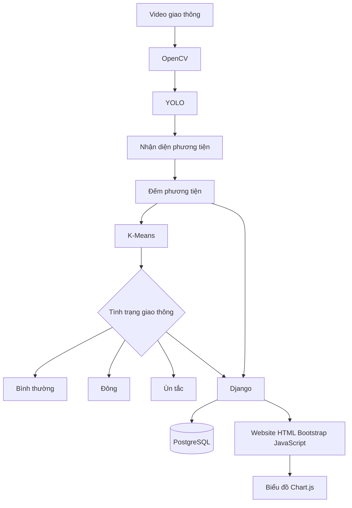

# Hệ thống giám sát giao thông

Hệ thống giám sát giao thông sử dụng video từ camera để tự động nhận diện, đếm phương tiện và đánh giá tình trạng giao thông theo ba mức:

- **Bình thường**
- **Đông**
- **Ùn tắc**

Ứng dụng xử lý các video giao thông có sẵn bằng OpenCV, mô hình YOLO và thuật toán K-Means. Django, PostgreSQL và giao diện web HTML, Bootstrap, JavaScript với Chart.js được dùng để quản lý, lưu trữ và hiển thị kết quả đồ án.

## 1. Mục tiêu

- Sử dụng các video giao thông làm dữ liệu đầu vào cho quá trình huấn luyện và kiểm thử.
- Phát hiện các phương tiện như ô tô, xe máy, xe buýt và xe tải.
- Đếm số lượng phương tiện theo từng khoảng thời gian.
- Phân tích mật độ giao thông bằng K-Means.
- Lưu kết quả xử lý và thống kê theo từng video vào PostgreSQL.
- Hiển thị dữ liệu giám sát trên website Django.
- Trực quan hóa số lượng phương tiện và trạng thái giao thông bằng Chart.js.

## 2. Công nghệ sử dụng

| Thành phần | Công nghệ | Vai trò |
|---|---|---|
| Frontend | HTML, Bootstrap, JavaScript | Xây dựng giao diện giám sát và tương tác người dùng |
| Backend | Django | Cung cấp website, API và quản lý nghiệp vụ |
| Nhận diện ảnh | OpenCV | Đọc video, xử lý từng khung hình và tiền xử lý ảnh |
| Trí tuệ nhân tạo | YOLO | Nhận diện phương tiện trong từng khung hình |
| Phân loại mật độ | K-Means | Phân nhóm dữ liệu để xác định tình trạng giao thông |
| Cơ sở dữ liệu | PostgreSQL | Lưu phương tiện, kết quả đếm và lịch sử trạng thái |
| Biểu đồ | Chart.js | Hiển thị dữ liệu thống kê trực quan |

## 3. Kiến trúc hệ thống



## 4. Luồng xử lý

1. **Tiếp nhận dữ liệu**: OpenCV mở video giao thông từ tệp trong thư mục dữ liệu.
2. **Đọc khung hình**: Video được tách thành các khung hình để xử lý.
3. **Nhận diện**: YOLO xác định vị trí và loại phương tiện trong mỗi khung hình.
4. **Đếm phương tiện**: Hệ thống tổng hợp số phương tiện theo vùng quan sát hoặc theo vạch đếm.
5. **Phân tích mật độ**: Các đặc trưng như số lượng phương tiện, tốc độ thay đổi và thời gian được đưa vào K-Means.
6. **Xác định trạng thái**: Kết quả phân nhóm được ánh xạ thành `Bình thường`, `Đông` hoặc `Ùn tắc`.
7. **Lưu trữ**: Django ghi kết quả nhận diện, số lượng phương tiện và trạng thái theo từng video vào PostgreSQL.
8. **Hiển thị**: Website lấy dữ liệu từ Django để hiển thị kết quả xử lý và biểu đồ Chart.js.

## 5. Đề xuất cấu trúc thư mục

```text
giamsatgiaothong/
├── manage.py
├── requirements.txt
├── .env.example
├── README.md
├── scripts/                   # Lệnh huấn luyện, đánh giá và suy luận
├── src/                       # Mã nguồn và tiện ích kiểm tra
├── docs/                      # Tài liệu kỹ thuật
├── config/                    # Cấu hình Django và URL gốc
├── traffic/                   # Ứng dụng quản lý giao thông
│   ├── migrations/
│   ├── models.py              # Mô hình dữ liệu PostgreSQL
│   ├── views.py               # Website và API
│   ├── urls.py
│   ├── services/
│   │   ├── video_processor.py # Đọc video bằng OpenCV
│   │   ├── detector.py        # Nhận diện bằng YOLO
│   │   ├── counter.py         # Đếm phương tiện
│   │   └── classifier.py      # Phân loại bằng K-Means
│   ├── templates/
│   └── static/
│       ├── css/
│       └── js/
├── dataset/                   # Video dùng để huấn luyện và kiểm thử
│   ├── train/
│   └── test/
└── weights/                   # Tệp trọng số YOLO
```

## 6. Yêu cầu môi trường

- Python 3.10 trở lên.
- Django 4.2 trở lên.
- PostgreSQL 14 trở lên (dùng để lưu kết quả đồ án).
- Git.
- GPU NVIDIA và CUDA là tùy chọn, giúp rút ngắn thời gian huấn luyện.
- Các video giao thông dùng làm dữ liệu huấn luyện và kiểm thử.
- Tệp trọng số YOLO sau khi huấn luyện hoặc mô hình YOLO được chọn cho đồ án.

## 7. Cài đặt dự án

### 7.1. Tạo môi trường ảo

Windows PowerShell:

```powershell
python -m venv .venv
.\.venv\Scripts\Activate.ps1
```

Linux hoặc macOS:

```bash
python3 -m venv .venv
source .venv/bin/activate
```

### 7.2. Cài đặt thư viện

```bash
pip install -r requirements.txt
```

Một `requirements.txt` tham khảo:

```text
Django>=4.2,<6.0
opencv-python>=4.8
ultralytics>=8.0
numpy>=1.24
scikit-learn>=1.3
psycopg[binary]>=3.1
python-dotenv>=1.0
```

### 7.3. Tạo cơ sở dữ liệu PostgreSQL

```sql
CREATE DATABASE traffic_monitoring;
CREATE USER traffic_user WITH PASSWORD 'thay_mat_khau_tai_day';
GRANT ALL PRIVILEGES ON DATABASE traffic_monitoring TO traffic_user;
```

Không đưa mật khẩu thật vào mã nguồn hoặc Git. Có thể tạo tệp `.env` từ `.env.example`:

```env
DJANGO_SECRET_KEY=thay-secret-key
DJANGO_DEBUG=True

POSTGRES_DB=traffic_monitoring
POSTGRES_USER=traffic_user
POSTGRES_PASSWORD=thay_mat_khau_tai_day
POSTGRES_HOST=127.0.0.1
POSTGRES_PORT=5432

YOLO_MODEL_PATH=weights/best.pt
```

### 7.4. Khởi tạo Django

```bash
python manage.py migrate
python manage.py createsuperuser
python manage.py collectstatic
python manage.py runserver
```

Mở website tại: <http://127.0.0.1:8000/>

Trang quản trị Django: <http://127.0.0.1:8000/admin/>

## 8. Dữ liệu video và mô hình huấn luyện

Dữ liệu đầu vào của đồ án là các video giao thông. Có thể chia video thành hai nhóm:

- `dataset/train/`: video dùng để trích xuất dữ liệu, huấn luyện hoặc điều chỉnh mô hình.
- `dataset/test/`: video độc lập dùng để đánh giá khả năng nhận diện và đếm phương tiện.

Quy trình đề xuất:

1. Thu thập các video giao thông có góc quay và điều kiện khác nhau.
2. Trích xuất một số khung hình đại diện từ video bằng OpenCV.
3. Gắn nhãn phương tiện trên các khung hình nếu cần huấn luyện YOLO tùy chỉnh.
4. Huấn luyện YOLO và lưu trọng số vào thư mục `weights/`.
5. Chạy mô hình trên các video kiểm thử.
6. Lưu số lượng phương tiện và trạng thái giao thông để so sánh, đánh giá.

Trong phạm vi đồ án, hệ thống không yêu cầu camera trực tiếp hoặc xử lý nhiều camera đồng thời.

## 9. Mô hình dữ liệu đề xuất

Các nhóm dữ liệu chính:

- **Video**: tên tệp, đường dẫn, thời lượng và ngày xử lý.
- **VehicleDetection**: loại phương tiện, độ tin cậy, tọa độ khung bao và thời điểm nhận diện.
- **TrafficSnapshot**: tổng số phương tiện theo khoảng thời gian.
- **TrafficStatus**: kết quả phân loại `normal`, `crowded` hoặc `congested`.

Mỗi kết quả nên liên kết với một video cụ thể để có thể xem lại và so sánh giữa các lần chạy.

## 10. Phân loại tình trạng giao thông bằng K-Means

K-Means chia dữ liệu giao thông thành các cụm dựa trên những đặc trưng đã chọn, ví dụ:

- Số phương tiện trong một khoảng thời gian.
- Mật độ phương tiện trên vùng quan sát.
- Tốc độ thay đổi của số phương tiện.
- Thời gian xử lý hoặc vận tốc trung bình nếu video có đủ thông tin để ước lượng.

Sau khi huấn luyện, cần ánh xạ các cụm theo mức độ tăng dần của mật độ:

```text
Cụm có mật độ thấp  -> Bình thường
Cụm có mật độ vừa    -> Đông
Cụm có mật độ cao    -> Ùn tắc
```

Việc ánh xạ này cần được lưu cùng phiên bản mô hình để kết quả ổn định giữa các lần chạy. Không nên giả định số thứ tự cụm của K-Means luôn có cùng ý nghĩa.

## 11. Giao diện website

Website nên cung cấp các màn hình chính:

- **Danh sách video**: tải lên, chọn và xử lý video giao thông.
- **Kết quả nhận diện**: xem video cùng các khung nhận diện YOLO.
- **Thống kê**: số lượng phương tiện theo video hoặc loại phương tiện.
- **Phân loại giao thông**: hiển thị kết quả `Bình thường`, `Đông` hoặc `Ùn tắc`.
- **So sánh kết quả**: đối chiếu kết quả giữa các video kiểm thử.

Chart.js có thể được dùng cho:

- Biểu đồ đường thể hiện số phương tiện theo thời gian.
- Biểu đồ cột so sánh các loại phương tiện.
- Biểu đồ doughnut thể hiện tỷ lệ phương tiện.
- Bộ lọc theo video và loại phương tiện.

## 12. API tham khảo

| Phương thức | Endpoint | Mục đích |
|---|---|---|
| `GET` | `/api/videos/` | Danh sách video |
| `GET` | `/api/traffic/current/` | Trạng thái giao thông của video đang xem |
| `GET` | `/api/traffic/stats/` | Dữ liệu cho biểu đồ |
| `GET` | `/api/traffic/history/` | Lịch sử trạng thái |
| `POST` | `/api/videos/` | Tải video lên để xử lý |

Response mẫu cho trạng thái hiện tại:

```json
{
  "video": "traffic-test-01.mp4",
  "status": "crowded",
  "status_label": "Đông",
  "vehicle_count": 42,
  "captured_at": "2026-08-27T10:30:00Z"
}
```

## 13. Kiểm thử và đánh giá

Trước khi chạy thực tế, cần kiểm tra:

- YOLO nhận diện đúng các loại phương tiện xuất hiện trong video.
- Không đếm trùng một phương tiện khi phương tiện đi qua nhiều khung hình.
- Kết quả đếm được lưu đúng video và thời điểm xử lý.
- Các cụm K-Means được ánh xạ đúng sang ba trạng thái.
- Website xử lý đúng trường hợp video không có dữ liệu hoặc video không hợp lệ.
- Có thể dùng các chỉ số Precision, Recall, mAP của YOLO và sai số đếm phương tiện để đánh giá.
- Không đưa video có bản quyền, dữ liệu riêng tư và trọng số lớn lên repository nếu không cần thiết.

Có thể chạy bộ kiểm thử Django bằng:

```bash
python manage.py test
```

## 14. Định hướng phát triển

- Huấn luyện YOLO bằng dữ liệu địa phương để phù hợp góc quay và điều kiện giao thông thực tế.
- Bổ sung tracking để tăng độ chính xác khi đếm phương tiện trong video.
- Thêm chức năng so sánh kết quả giữa mô hình YOLO gốc và mô hình đã huấn luyện.
- Cải thiện cách chọn đặc trưng và ánh xạ cụm K-Means.
- Đóng gói môi trường chạy bằng Docker nếu cần trình bày hoặc triển khai đồ án.

## 15. Giấy phép và dữ liệu

Hãy kiểm tra giấy phép của mô hình YOLO, bộ dữ liệu, video và các thư viện sử dụng. Không chia sẻ video có thể nhận diện cá nhân nếu chưa được phép.
